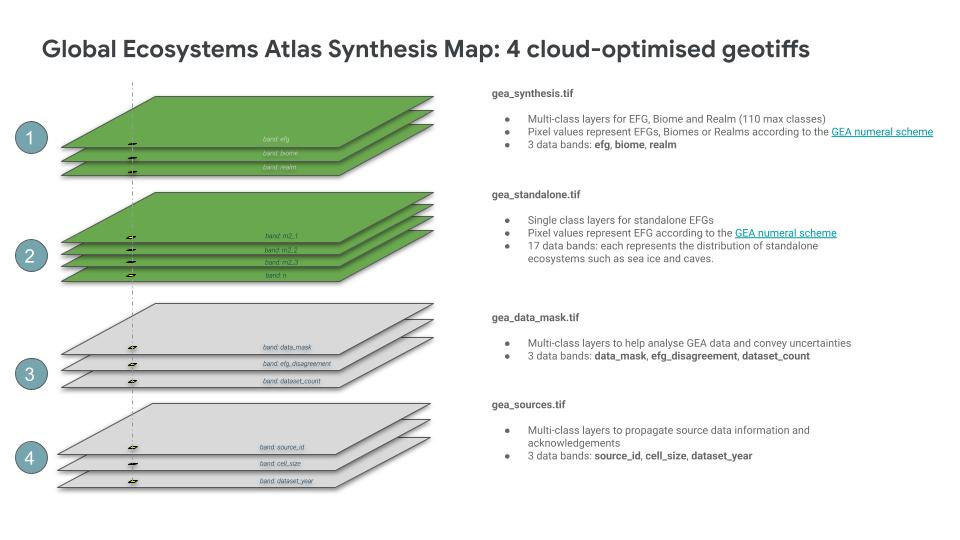
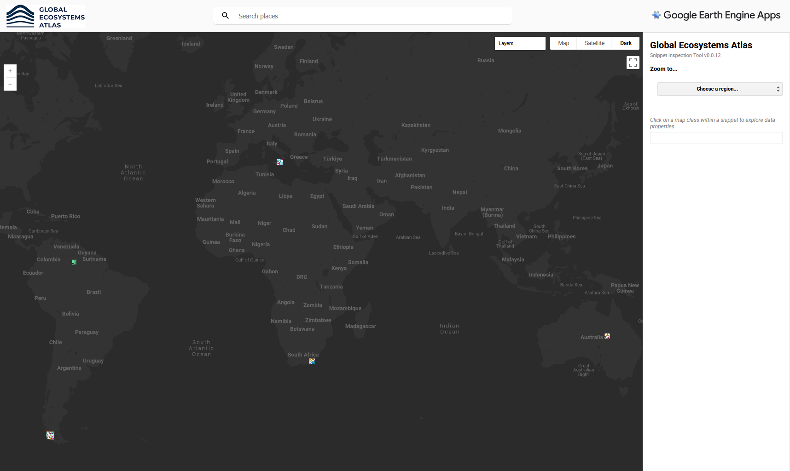

# Global Ecosystems Atlas sample data
This repository provides pre-release samples of the Global Ecosystems Atlas data products for developers, governments or other data users. The samples will enable users to understand the format of the data products and begin to build analysis pipelines from the data.

## Global Ecosystem Atlas Synthesis Map

Five snippets of the Global Ecosystems Atlas synthesis data are available for download. The snippets comply with the GEA synthesis data model, which is structured as four [cloud optimised geotiff](https://cogeo.org/) files:

* *gea_synthesis*: a 3-band multi-class cloud optimised geotiff that depicts the distributions of Ecosystem Functional Groups, biomes and realms.
* *gea_standalone*: a multiband  cloud optimised geotiff that depicts the distributions of ecosystems that cannot be served in a multiclass raster due to overlying or underlying other ecosystem types, such as pelagic ecosystems or sea ice.
* *gea_data_mask*: a 3-band cloud optimised geotiff with bands intended to support analyses of the gea_synthesis and gea_standalone data products.
* *gea_sources*: a 3-band cloud optimised geotiff with bands that depict aspects of the source data, such as source data id, the year the data were produced and the native cell size of source data. 

## Data format

| Image Name      | Type            | Bands               | Description                                                                              |
| --------------- | --------------- | ------------------- |------------------------------------------------------------------------------------------|
| `gea_synthesis.tif` | 8-bit integer | `efg`               | Pixel values represent ecosystem functional groups according to the [GEA numeral scheme](https://github.com/Global-Ecosystems-Atlas/metadata/tree/main//pixel-values) |
|                 |                 | `biome`             | Pixel values represent biome type according to the [GEA numeral scheme](https://github.com/Global-Ecosystems-Atlas/metadata/tree/main//pixel-values)|
|                 |                 | `realm`             | Pixel values represents realm type according to the [GEA numeral scheme](https://github.com/Global-Ecosystems-Atlas/metadata/tree/main//pixel-values) |
| `gea_standalone.tif`| 8-bit integer | `M2_1`              | Pixel values represent the distribution of [M2_1 Epipelagic ocean waters](https://global-ecosystems.org/explore/groups/M2.1) |
|                 |                 | `M2_2`              | Pixel values represent the distribution of [M2_2 Mesopelagic ocean waters](https://global-ecosystems.org/explore/groups/M2.2) |
|                 |                 | `...`               | Pixel values represent the distribution of each standalone ecosystem functional group following the Global Ecosystem Typology coded naming scheme |
| `gea_data_mask.tif` | 8-bit integer | `data_mask`         | Pixel values represent (0) no data, (1) valid data, (2) source data that could not be cross-referenced to the Global Ecosystem Typology |
|                 |                 | `efg_disagreement`  | Pixel values represent the number of different ecosystems mapped by overlapping source datasets |
|                 |                 | `dataset_count`     | Pixel values represent the number of source datasets that have mapped the pixel |
| `gea_sources.tif`   | 16-bit integer| `source_id`         | The individual identifier for each source dataset in the Global Ecosystems Atlas |
|                 |                 | `cell_size`         | The pixel size in metres of the source dataset |
|                 |                 | `dataset_year`      | The production year of the source dataset |


## Schematic of the synthesis map data model
The Global Ecosystems Atlas Synthesis Map is structured as a complementary set of 4 Cloud-optimised GeoTIFFs. 



## Sample data availability
The snippets have been packaged as .zip Cloud-Optimized Raster files and are available for download at this [link](https://radiantearth.github.io/stac-browser/#/external/global-ecosystems-atlas.github.io/stac/synthesis_map/snippets_v0_0_12/collection.json).

Please view the data interactively:

[](https://geo-global-ecosystems-atlas.projects.earthengine.app/view/gea-snippets)

## Data properties

Each of the four cloud-optimised raster files  in the Global Ecosystems Atlas Synthesis Map have the following properties. Note that colour palettes are provided in the properties and that QGIS, ArcGIS and standard hex code colour lists are provided in the [GEA palettes folder](https://github.com/Global-Ecosystems-Atlas/metadata/tree/main/palettes) of the [gea-metadata] (https://github.com/Global-Ecosystems-Atlas/metadata) repository. 

The numeral scheme, which indicate the pixel values that correspond to ecosystem functional group, biome or realm, are also provided in image properties or via the [pixel-values folder](https://github.com/Global-Ecosystems-Atlas/metadata/tree/main/pixel-values) of the [gea-metadata repository](https://github.com/Global-Ecosystems-Atlas/metadata). 

```
{
  date_generated: ee.Date(Date.now()),
  file_name: '', // changes per dataset to ['gea_synthesis', 'gea_standalone', 'gea_data_mask', 'gea_sources' ]
  spatial_resolution: 100,
  version: version,
  title: '',
  bands: '',
  class_palette_efg: palettes.efg_palette,
  class_names_efg:palettes.efg_names,
  class_values_efg: palettes.efg_values,
  class_palette_biome: palettes.biome_palette,
  class_names_biome: palettes.biome_names,
  class_values_biome: palettes.biome_values,
  class_palette_realm: palettes.realm_palette,
  class_names_realm: palettes.realm_names,
  class_values_realm:palettes.realm_values,
  standalone_efgs: palettes.standalone_efgs,
  status: 'do-not-distribute',
  contact: 'nicholas.murray@jcu.edu.au',
  source_url: 'https://github.com/Global-Ecosystems-Atlas',
  citation: 'TBA',
  doi: 'TBA',
  license: 'TBA'
};
```
## Frequently asked questions

*How can I view the data?*

* The easiest way to view the data is in the Google Earth Engine app linked above. Make sure to use the layer function (top right corner) to step through the 9 standard data layers of the Atlas synthesis map, as well as the standalone data layers.
* You can also download the .zip files in this repository, unzip them and import them into QGIS or ArcGIS. Note that the geotiff data include multiple bands (similar to a satellite image), so you will need to either extract bands (e.g. in [ArcGIS](https://pro.arcgis.com/en/pro-app/latest/help/analysis/raster-functions/extract-bands-function.htm)) or use the symbology tools to show the unique palette for a classified image. Files are available in the [gea-metadata repository](https://github.com/Global-Ecosystems-Atlas/metadata/tree/main/palettes) to assist in loading the colour palettes into ArcGIS and QGIS.

## Contact
For any questions or queries regarding this dataset, please contact William Masson or [Nick Murray](mailto:nicholas.murray@jcu.edu.au).

## License
These data snippets are licensed under a Creative Commons Attribution-Non Commercial 4.0 International License. [CC BY-NC 4.0](https://creativecommons.org/licenses/by-nc/4.0/)
